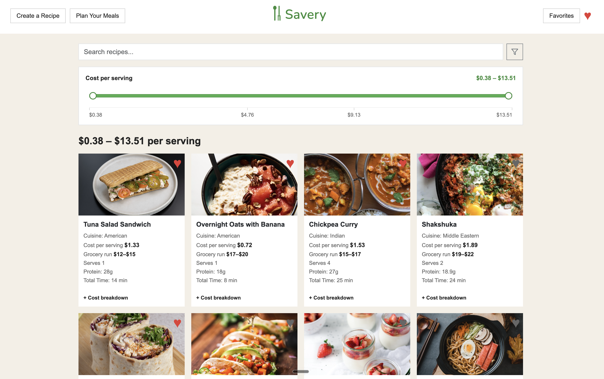

# Savery

A web application that helps college students discover affordable recipes, save their favorites, and create budget-friendly meal plans.

It was nice to see a great idea implemented this well, so great work! The leftover recommendation feature was well done. The scoring logic in recommendations.js where it ranks suggestions by fewest extra packages needed, then most shared ingredients, then cheapest is a implemented with design thought behind it and isn’t just a feature that technically works. And that combined with the cost per serving vs grocery run distinction is what makes this feel very personalized, which stood out to me!
A few things I noticed reading through the code though. favoritesPage.js still has a comment at the top referencing localStorage which looks like it's leftover from before you moved everything to MongoDB. 
Also I was wondering if you thought about what happens when two people submit a new recipe at the same time. getNextRecipeId reads the current max and increments it so two simultaneous requests could maybe grab the same ID? I don’t know if it could exactly happens at this scale but it's an interesting edge case to that came ot me when I was going through your code.
I loved the UI design as well, and enjoyed reviewing your code!


## Authors

- **Melissa Rejuan**
- **James Jacob**

## Live Demo

[https://savery-production.up.railway.app/](https://savery-production.up.railway.app/)

## Class Link

[Web Development — Project 2](https://johnguerra.co/classes/webDevelopment_online_summer_2026/)

## Project Objective

Savery helps college students eat well on a tight budget. Users can:

- **Discover recipes** with search, filters (cuisine, meal type, diet, prep time), and a cost-per-serving range slider
- **View recipe details** including shopping lists, ingredient costs, instructions, and leftover recommendations
- **Save favorites** to MongoDB for quick access later
- **Create and submit recipes** that are stored in the database and appear on the discovery page
- **Plan weekly meals** on a Breakfast / Lunch / Dinner grid and save meal plans to MongoDB

The app uses a multi-page **client-side rendered (CSR)** frontend, an **Express** REST API, and **MongoDB** for persistence.

## Screenshot



## Pages

| Page | URL | Description |
|------|-----|-------------|
| Recipe Discovery | `/index.html` | Browse, filter, and expand recipes |
| Create a Recipe | `/createRecipes.html` | Submit a new recipe to the database |
| Plan Your Meals | `/planner.html` | Build and save weekly meal plans |
| Favorites | `/favorites.html` | View and remove saved recipes |

## Technologies

- HTML5, CSS3, Bootstrap 5
- JavaScript (ES6 modules)
- Node.js, Express.js
- MongoDB (native driver)

## Project Structure

```
Savery/
├── backend.js              # Express server entry point
├── routes/                 # API route modules
│   ├── recipeApi.js
│   ├── favoritesApi.js
│   └── plannerApi.js
├── db/
│   └── MyMongoDB.js        # Database connector module
├── data/
│   └── recipes.json        # Seed data (1000 recipes)
├── scripts/
│   └── seed-mongodb.js     # Loads recipes into MongoDB
└── frontend/
    ├── index.html          # Recipe Discovery
    ├── createRecipes.html
    ├── planner.html
    ├── favorites.html
    ├── css/                # Modular stylesheets per page
    └── js/                 # Page scripts (ES modules)
```

## MongoDB Collections

| Collection | Purpose |
|------------|---------|
| `Recipes` | Recipe documents (seeded + user-submitted) |
| `Favorites` | Saved recipe IDs per user |
| `MealPlans` | Weekly meal plan documents |

## Prerequisites

- [Node.js](https://nodejs.org/) (v18 or newer recommended)
- [MongoDB](https://www.mongodb.com/) running locally **or** a MongoDB Atlas connection string

## Instructions to Build and Run

### 1. Clone the repository

```bash
git clone https://github.com/jamesjacob2001/Savery.git
cd Savery
```

### 2. Install dependencies

```bash
npm install
```

### 3. Start MongoDB

**Local (default):** make sure MongoDB is running on `mongodb://localhost:27017`.

**MongoDB Atlas (optional):** set your connection string before seeding or starting the server:

```bash
export MONGODB_URI="mongodb+srv://<user>:<password>@<cluster>.mongodb.net/?retryWrites=true&w=majority"
```

### 4. Seed the database

This loads `data/recipes.json` into the `Savery.Recipes` collection (replaces existing recipe documents):

```bash
npm run seed
```

### 5. Start the server

```bash
npm start
```

The app runs at [http://localhost:3000](http://localhost:3000).

### 6. Verify the app

- Open **Recipe Discovery** — you should see the recipe grid after seeding
- Try **Favorites** (heart icon on a card) and **Plan Your Meals** (add recipes to slots and save a plan)

## API Endpoints

| Method | Endpoint | Description |
|--------|----------|-------------|
| `GET` | `/api/recipes` | List all recipes |
| `POST` | `/api/recipes` | Create a recipe |
| `GET` | `/api/favorites` | List saved favorites |
| `POST` | `/api/favorites` | Save a favorite |
| `DELETE` | `/api/favorites/:recipeId` | Remove a favorite |
| `GET` | `/api/planner` | List meal plans |
| `POST` | `/api/planner` | Create a meal plan |
| `PUT` | `/api/planner/:id` | Update a meal plan |
| `DELETE` | `/api/planner/:id` | Delete a meal plan |

## License

MIT
